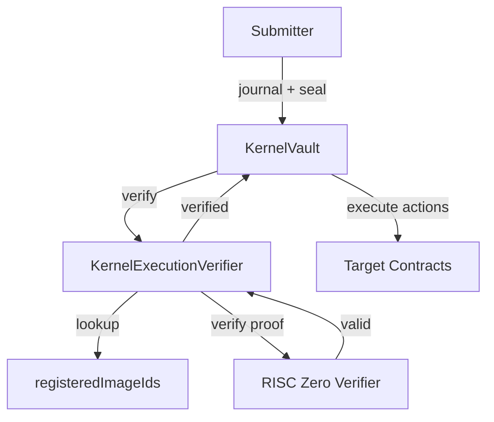
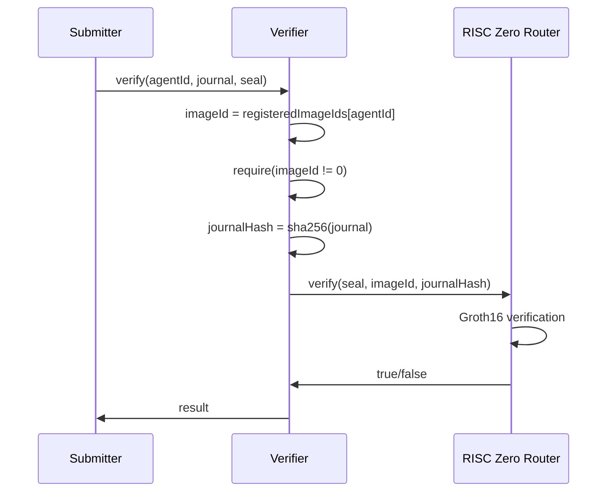

# On-Chain Verifier Overview

The `KernelExecutionVerifier` contract validates zkVM proofs and manages agent registrations on-chain.

## Architecture



## Deployed Contracts (Sepolia)

| Contract | Address |
|----------|---------|
| KernelExecutionVerifier | `0x9Ef5bAB590AFdE8036D57b89ccD2947D4E3b1EFA` |
| KernelVault | `0xAdeDA97D2D07C7f2e332fD58F40Eb4f7F0192be7` |
| MockYieldSource | `0x7B35E3F2e810170f146d31b00262b9D7138F9b39` |
| RISC Zero Verifier Router | `0x925d8331ddc0a1F0d96E68CF073DFE1d92b69187` |

## KernelExecutionVerifier

### State Variables

```solidity
// RISC Zero verifier router
IRiscZeroVerifier public immutable riscZeroVerifier;

// Mapping: agentId => registered imageId
mapping(bytes32 => bytes32) public registeredImageIds;
```

### Key Functions

#### verify

```solidity
function verify(
    bytes32 agentId,
    bytes calldata journal,
    bytes calldata seal
) external view returns (bool)
```

Verifies a proof for a specific agent:

1. Looks up registered imageId for agentId
2. Calls RISC Zero verifier with seal, imageId, and journal hash
3. Returns true if proof is valid

#### registerAgent

```solidity
function registerAgent(
    bytes32 agentId,
    bytes32 imageId
) external onlyOwner
```

Registers an imageId for an agent. Only the contract owner can call this.

#### deregisterAgent

```solidity
function deregisterAgent(bytes32 agentId) external onlyOwner
```

Removes an agent's registration.

### Verification Flow



## KernelVault

The vault holds capital and executes agent actions after verification.

### State Variables

```solidity
// Verifier contract reference
IKernelExecutionVerifier public immutable verifier;

// Replay protection
uint64 public lastExecutionNonce;

// Authorized agent
bytes32 public authorizedAgentId;
```

### execute Function

```solidity
function execute(
    bytes calldata journal,
    bytes calldata seal,
    bytes calldata agentOutput
) external
```

1. Parses the journal using KernelOutputParser
2. Validates execution status is Success
3. Validates nonce is lastExecutionNonce + 1
4. Validates agentId matches authorized agent
5. Calls verifier.verify()
6. Verifies action commitment matches sha256(agentOutput)
7. Parses and executes actions
8. Updates lastExecutionNonce

### Action Execution

```solidity
function _executeAction(ActionV1 memory action) internal {
    if (action.actionType == ACTION_TYPE_CALL) {
        _executeCall(action);
    } else if (action.actionType == ACTION_TYPE_TRANSFER_ERC20) {
        _executeTransferERC20(action);
    } else {
        revert("Unknown action type");
    }
}
```

## KernelOutputParser

Library for parsing the 209-byte journal.

```solidity
library KernelOutputParser {
    struct ParsedJournal {
        uint32 protocolVersion;
        uint32 kernelVersion;
        bytes32 agentId;
        bytes32 agentCodeHash;
        bytes32 constraintSetHash;
        bytes32 inputRoot;
        uint64 executionNonce;
        bytes32 inputCommitment;
        bytes32 actionCommitment;
        uint8 executionStatus;
    }

    function parse(bytes calldata journal)
        internal
        pure
        returns (ParsedJournal memory)
    {
        require(journal.length == 209, "Invalid journal length");

        return ParsedJournal({
            protocolVersion: uint32(bytes4(journal[0:4])),
            kernelVersion: uint32(bytes4(journal[4:8])),
            agentId: bytes32(journal[8:40]),
            agentCodeHash: bytes32(journal[40:72]),
            constraintSetHash: bytes32(journal[72:104]),
            inputRoot: bytes32(journal[104:136]),
            executionNonce: uint64(bytes8(journal[136:144])),
            inputCommitment: bytes32(journal[144:176]),
            actionCommitment: bytes32(journal[176:208]),
            executionStatus: uint8(journal[208])
        });
    }
}
```

## Agent Registration

### Registering an Agent

```bash
# Get the imageId from your build
export IMAGE_ID=$(cat dist/agent-pack.json | jq -r '.image_id')
export AGENT_ID=0x0000000000000000000000000000000000000000000000000000000000000001
export VERIFIER=0x9Ef5bAB590AFdE8036D57b89ccD2947D4E3b1EFA

# Register (requires owner privileges)
cast send $VERIFIER "registerAgent(bytes32,bytes32)" \
    $AGENT_ID $IMAGE_ID \
    --private-key $PRIVATE_KEY --rpc-url $RPC_URL
```

### Checking Registration

```bash
# Query registered imageId
cast call $VERIFIER "registeredImageIds(bytes32)(bytes32)" \
    $AGENT_ID --rpc-url $RPC_URL
```

### Yield Agent Registration

| Field | Value |
|-------|-------|
| IMAGE_ID | `0x5f42241afd61bf9e341442c8baffa9c544cf20253720f2540cf6705f27bae2c4` |
| AGENT_CODE_HASH | `0x5aac6b1fedf1b0c0ccc037c3223b7b5c8b679f48b9c599336c0dc777be88924b` |
| AGENT_ID | `0x0000000000000000000000000000000000000000000000000000000000000001` |

## Gas Costs

Typical gas consumption:

| Operation | Gas |
|-----------|-----|
| Groth16 verification | ~300,000 |
| Journal parsing | ~20,000 |
| Action execution | Variable |
| Total execute() | ~400,000 - 500,000 |

## Related

- [Solidity Integration](/onchain/solidity-integration) - Integration details
- [Security Considerations](/onchain/security-considerations) - Trust assumptions
- [End-to-End Flow](/architecture/overview) - Complete execution flow
